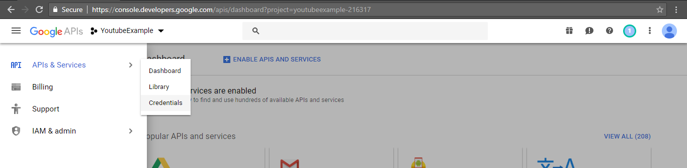
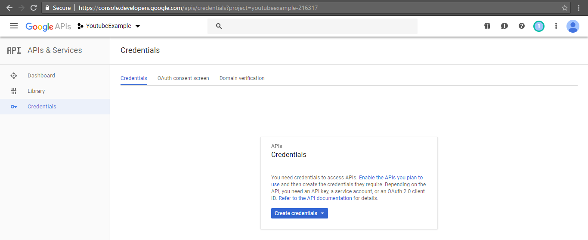
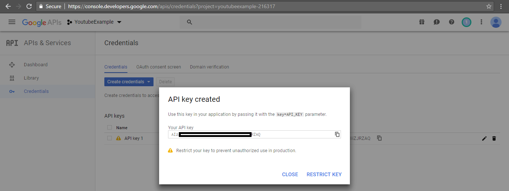
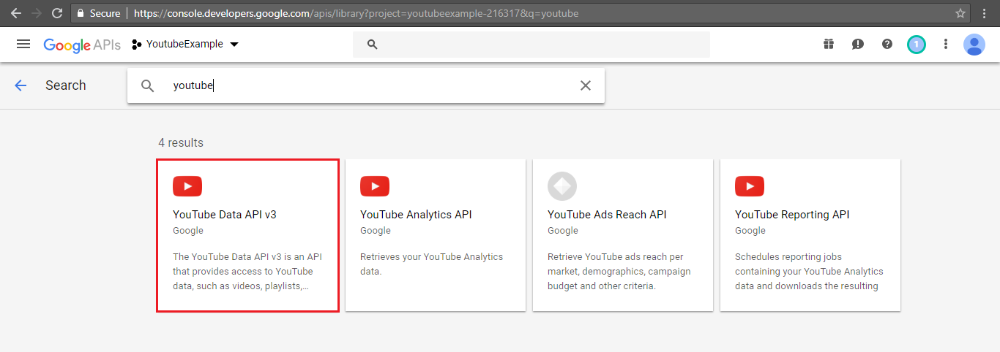
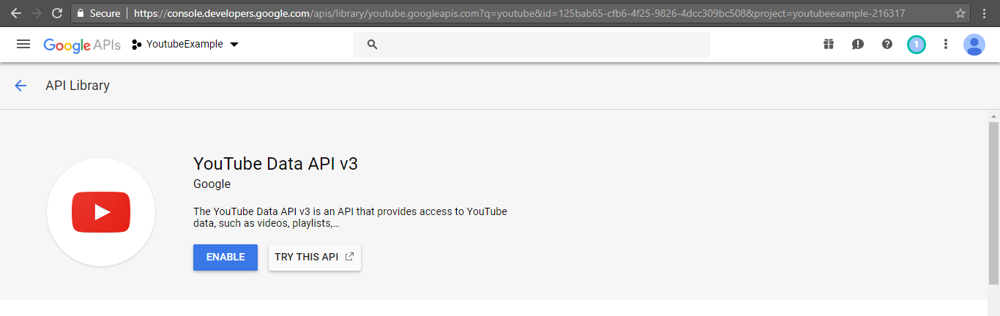

### Description
React-Native Youtube integrate 
### Technologies
* React-native

### Prerequisites to run
* [React-native-cli](https://facebook.github.io/react-native/docs/getting-started)
* [Node.js](https://nodejs.org/en/download/)
* [Android Studio (android emulator) or real android devices](https://developer.android.com/studio)
* [Youtube apiKey](https://nodejs.org/en/download/)

### Installing
Clone the project:
```
$ git clone https://github.com/longnguyendr/testing.git
```
Install the dependencies:
```
$ cd testing
$ npm install
```
Before run the app you must generate the API Key:

```
if you dont have existing project create new one. After that you can create credential and apiKey.
```

<p align="center">
</p>

<p align="center">
</p>

<p align="center">
</p>

```
Then enable the service before use the apiKey
```

<p align="center">
</p>

<p align="center">
</p>

```
Then copy the apiKey to test/src/components/env.js 
```

Run the App:

```
if you update dependencies please run the following command immigrate the library to androidX:
npx jetify 
```

```
for development: 
npm run android 
or 
npm run android --reset-cache
```


```
for product: npm run product
```

### Author
Long Nguyen